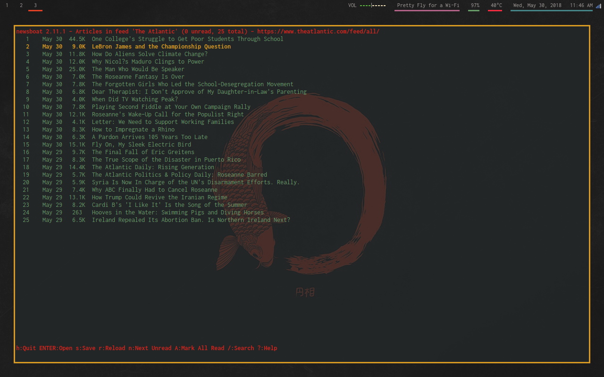

# Dot Files

My personal dotfiles

Basics
+ Window Manger: I3-Gaps
+ Terminal Emulator: Suckless Terminal
+ Notification Daemon: Dunst
+ Process Viewer: Htop
+ Disk Mounter: UDiskie
+ Screenshot Tool: Scrot

### Web Browser (Qutebrowser)

### Text Editor (Vim)

### Nerd Flex (Neofetch)

### File Manager (Ranger)

### RSS Feed Reader (Newsboat)

### Application Launcher (Rofi)

